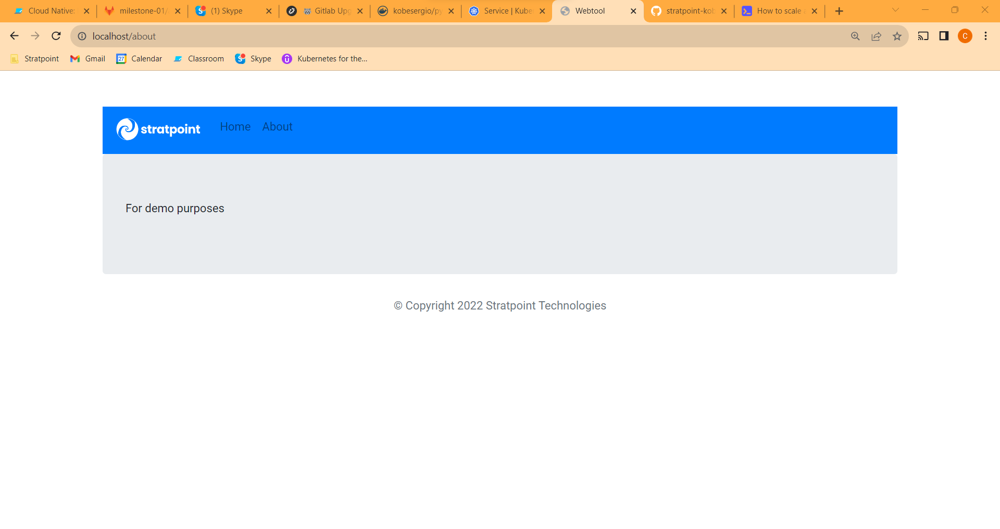
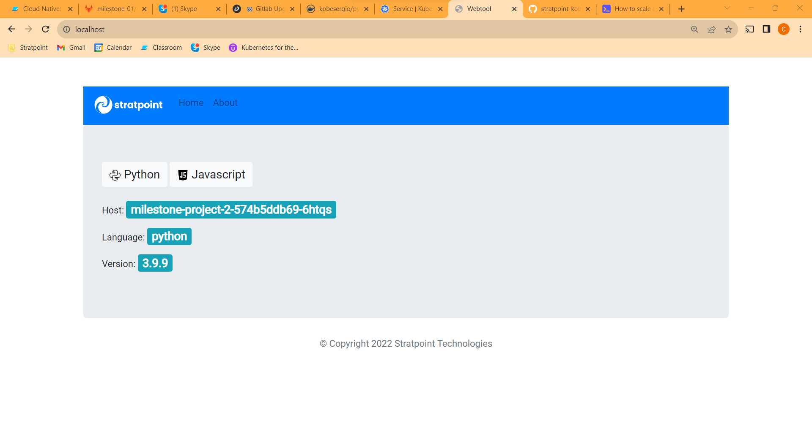
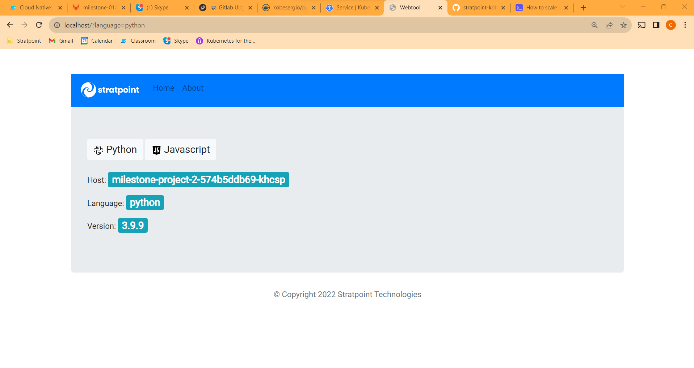
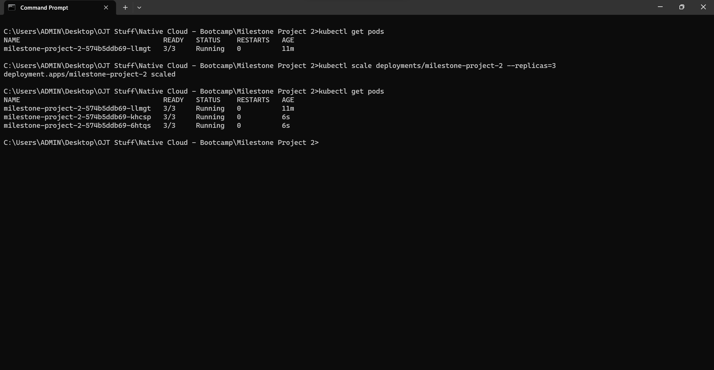

## Milestone Project 2

Synthesis: "Milestone Project 2" is a basically Milestone Project 1 but in a container orchestrated environment. In this project I learned how to use Kubernetes.

To start things off, I got to know the fundamentals of k8s. From Containers, Pods, to Deployment; from .envs to Secrets to ConfigMaps; and from networks, ports, to Services. I got myself very much familiarized with all of the basics of k8s. 

Upon building Milestone Project 2, I encountered multiple bugs and hindrances. One of which was Rancher desktop being faulty, I had to experiment with the container engines that works on my device. Next was the ports, I ran into a problem where the page was not loading and just showing an error 404 page then I was advised to set up the service IP manually which actually worked. Lastly, I scaled up my the deployment by adding more replicas.

Fully synthesizing these chapters, I have learned a lot on container orchestration and had more understanding on containers.

### Documentation

1. configmap.yml - This is where the secrets were contained. I changed the base url of the secrets to localhost because the container was not able to fetch docker.host.

2. milestone-project.yml - This is the bread and butter of the container orchestration. This is where the deployment properties are stored. 

3. service.yml - Lastly, the service.yml is where we declare the ports to be listened on and exposed on the machine. 